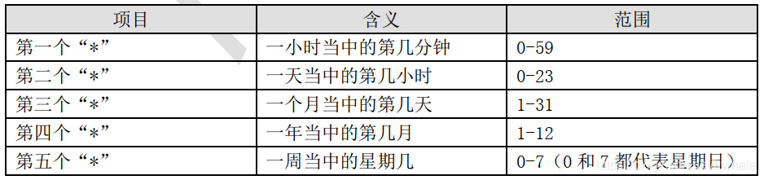

<!--toc-->

hello hugo

<!--more-->

# 启动

hugo.exe server -buildDrafts

# 页面

## 标签tags

tags: ["教程", "开发"]

## 标题

默认是文件名

## 摘要

`<!--more-->`后面的是正文

## 代码高亮

```java
    /**
     * 驼峰转下划线
     * @param str
     * @return
     */
    public static String humpToLine(String str) {
        Matcher matcher = humpPattern.matcher(str);
        StringBuffer sb = new StringBuffer();
        while (matcher.find()) {
            matcher.appendReplacement(sb, "_" + matcher.group(0).toUpperCase());
        }
        matcher.appendTail(sb);
        return sb.toString().toUpperCase();
    }
```


## 图片


## 页内标题

400字以上会自动添加toc

通过toc:true可强制开启

目前这个目录不能悬浮显示。无所谓了

# about


# 线上

## ssl

let's encrypt 免费。

这个网站可以选服务器(nginx\tomcat等)和操作系统，按教程配置let's encrypt

### snap

[Certbot Instructions | Certbot (eff.org)](https://certbot.eff.org/instructions?ws=nginx&os=centosrhel7)

需要安装snap，上面的网址没有centos的。其他网址找了个centos7安装snap的教程

> snap是一个应用商店https://snapcraft.io/store

[CentOS 安装 SNAP - 白马黑衣 - 博客园 (cnblogs.com)](https://www.cnblogs.com/eagle6688/p/17125126.html)

```
[root@racknerd-60d976 sbin]# sudo snap install --classic certbot
error: cannot communicate with server: Post "http://localhost/v2/snaps/certbot": dial unix /run/snapd.socket: connect: no such file or directory

```

重启snap服务

```
[root@racknerd-60d976 sbin]# systemctl restart snapd.service
[root@racknerd-60d976 sbin]# sudo snap install --classic certbot
error: cannot install "certbot": classic confinement requires snaps under /snap or symlink from
       /snap to /var/lib/snapd/snap
```


```
sudo ln -sf /var/lib/snapd/snap /snap
```

### 用snap安装certbot

```
[root@racknerd-60d976 sbin]# sudo certbot --nginx
Saving debug log to /var/log/letsencrypt/letsencrypt.log
The nginx plugin is not working; there may be problems with your existing configuration.
The error was: NoInstallationError("Could not find a usable 'nginx' binary. Ensure nginx exists, the binary is executable, and your PATH is set correctly.")

```

> Certbot默认nginx配置文件在 /etc/nginx/nginx.conf或 /usr/local/etc/nginx/nginx.conf，若你的nginx配置文件不在此处（以/usr/local/nginx/conf/nginx.conf为例），需在命令后加上 --nginx-server-root /usr/local/nginx/conf
> ————————————————
> 版权声明：本文为CSDN博主「the丶only」的原创文章，遵循CC 4.0 BY-SA版权协议，转载请附上原文出处链接及本声明。
> 原文链接：https://blog.csdn.net/weixin_52270081/article/details/118094851


ln -s /usr/local/nginx/sbin/nginx /usr/bin/nginx

he error was: PluginError('Nginx build is missing SSL module (--with-http_ssl_module).')

重新编译

./configure: error: SSL modules require the OpenSSL library.

需要安装ssl lib包。

yum -y install openssl openssl-devel


ssl  部署成功之后把443端口放开

```
[root@racknerd-60d976 nginx]# sudo certbot --nginx --nginx-server-root /usr/local/nginx/conf
Saving debug log to /var/log/letsencrypt/letsencrypt.log

Which names would you like to activate HTTPS for?
We recommend selecting either all domains, or all domains in a VirtualHost/server block.
- - - - - - - - - - - - - - - - - - - - - - - - - - - - - - - - - - - - - - - -
1: runfast.life
2: www.runfast.life
- - - - - - - - - - - - - - - - - - - - - - - - - - - - - - - - - - - - - - - -
Select the appropriate numbers separated by commas and/or spaces, or leave input
blank to select all options shown (Enter 'c' to cancel): 
Requesting a certificate for runfast.life and www.runfast.life

Successfully received certificate.
Certificate is saved at: /etc/letsencrypt/live/runfast.life/fullchain.pem
Key is saved at:         /etc/letsencrypt/live/runfast.life/privkey.pem
This certificate expires on 2023-07-27.
These files will be updated when the certificate renews.
Certbot has set up a scheduled task to automatically renew this certificate in the background.

Deploying certificate
Successfully deployed certificate for runfast.life to /usr/local/nginx/conf/nginx.conf
Successfully deployed certificate for www.runfast.life to /usr/local/nginx/conf/nginx.conf
Congratulations! You have successfully enabled HTTPS on https://runfast.life and https://www.runfast.life

- - - - - - - - - - - - - - - - - - - - - - - - - - - - - - - - - - - - - - - -
If you like Certbot, please consider supporting our work by:
 * Donating to ISRG / Let's Encrypt:   https://letsencrypt.org/donate
 * Donating to EFF:                    https://eff.org/donate-le
- - - - - - - - - - - - - - - - - - - - - - - - - - - - - - - - - - - - - - - -
[root@racknerd-60d976 nginx]# firewall-cmd --permanent --zone=public --add-port=443/tcp
success
[root@racknerd-60d976 nginx]# firewall-cmd --reload
success

```


## 服务器定时拉取仓库

crontab -e

```

```

查看crontab日志`cat /var/log/cron` 日志显示时间和系统时间相差了12个小时

重启内核日志：

> systemctl restart rsyslog

重启完之后发现内核日志的时间跟系统时间一样了，而crontab的日志还是相差12小时，再次重启crontab
重启crontab

> systemctl restart crond

```
Apr 28 13:24:24 racknerd-60d976 crond[32735]: (CRON) INFO (@reboot jobs will be run at computer's startup.)
^C
[root@racknerd-60d976 html]# date
Fri Apr 28 13:26:52 CST 2023
```


crontab 时间表达式错误

```
[root@racknerd-60d976 html]# crontab -e
crontab: installing new crontab
"/tmp/crontab.wrhg50":1: bad hour
errors in crontab file, can't install.
Do you want to retry the same edit? 
Enter Y or N
Do you want to retry the same edit? Y
crontab: installing new crontab
"/tmp/crontab.wrhg50":1: bad hour
errors in crontab file, can't install.
Do you want to retry the same edit? Y
crontab: installing new crontab
[root@racknerd-60d976 html]# crontab -e
crontab: installing new crontab

```

